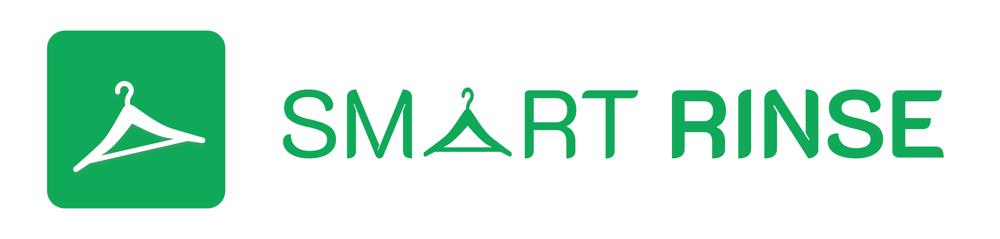
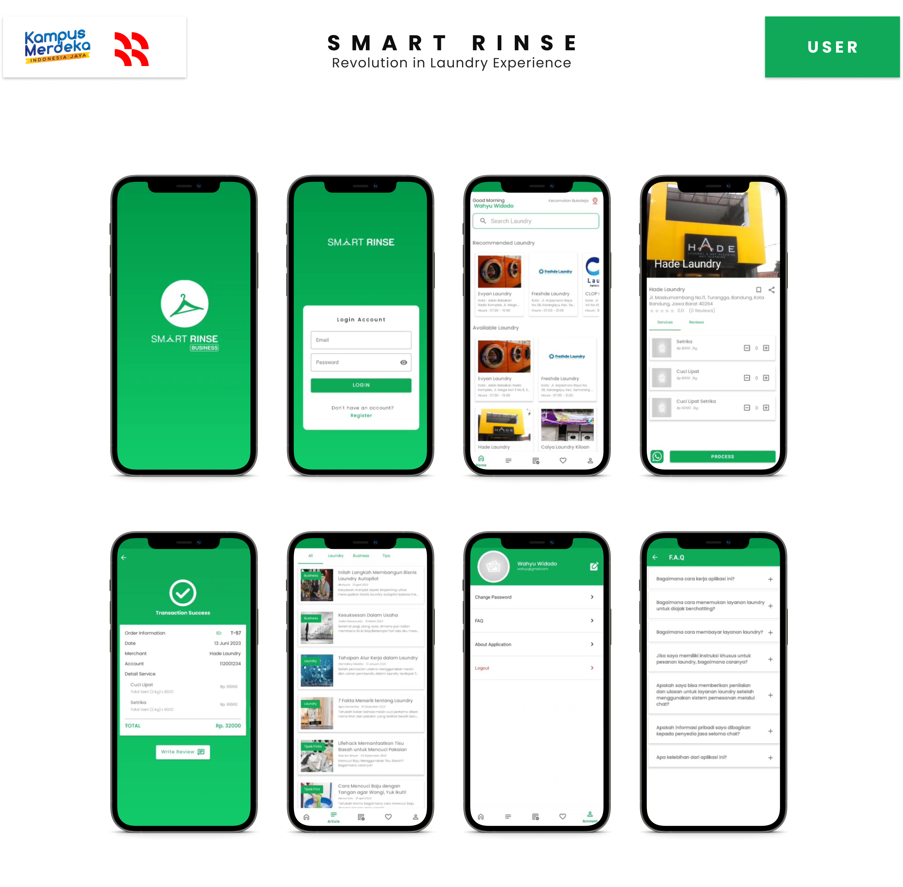

# Smart Rinse - Android Aplication

Smart Rinse App is an application for user to find the best laundry services around them. This best recommendation utilizes machine learning technology in the form of Sentiment Analysis from feedback and ratings given by customers on a laundry service.

## Features

The android app lets you:
- View and search for recommended laundry services.
- View articles about laundry.
- View order transaction details.
- Communicate with laundry service owners.
- Leave reviews for laundry services.
- Add laundry services to favorites.
- FAQ of the app and laundry services.
- Ad-Free.

## Screenshots

## Permissions

The minimum Android version that can use this app is Android 5.0, with the following permission requests:
- Internet Access
- Camera or Gallery Access.

Internet access permissions are made to communicate data from the cloud and process laundry recommendations. Camera permissions are made to change profile photos.
